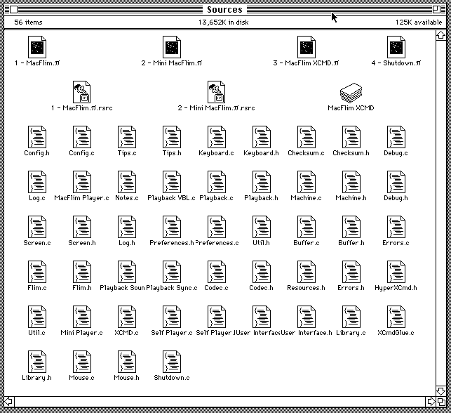
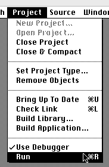
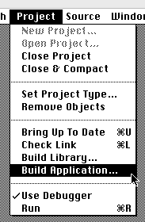



## Using Linux to develop on Mac


This, above, is a screenshot of my linux desktop, when developing MacFlim. While I did spend a lot of time debugging on the real hardware, I spent even more time in that environment.

You can see:
* On the top left, a custom ``minivmac`` version, running a disk image, with MacOS, the THINK C compiler, and the source code.

* On the bottom left, Inside Macintosh (in that case, the volume II, on the Sound Manager). There is no way one can develop with the mac without Inside Macintosh. When I was a Mac code, in 1985, I had the "Phone book" version of it (if anyone has one that he would be ready to part with, let me know). I used to sleep with Inside Mac under my pillow. I wish it wasn't true...

* On the top right, vscode, opened with the source code of ``flimmaker`` the ``.flim`` creation utility.

* And, on the bottom right, a terminal for compilation and execution of ``flimmaker``.

This right part of the screen is not the focus of today, we are talking about MacOS player app development (note: I have a blog post on ``flimmaker`` in the making for _several years_...)

## About minivmac

First, the minivmac has been compiled to be exactly a quarter of my screen, using the following options:

```
./setup_t -m IIx -t lx64 -mem 8M -hres 1280 -vres 768 -speed a -magnify 0 -depth 0 > setup.sh 
bash ./setup.sh 
make
```

This way, if I press _Control+Shift+F_, it takes my full screen, with nice 2x2 square pixels, giving a confortable working environment. _Control-Shift-F_ again, and I am back in Linux.

This is not the _standard_ minivmac, but a [custom version I created](https://github.com/fstark/minivmac).

I did that for a few reasons.

* First, the way the minivmac project is distributed is *awful*. The build process is ridiculously convoluted. In this codebase, I have a README that I can refer to to build it.

* Second, I wanted a stable version, and I have no idea, if I pull the source from upstream, what version I will get, and if it will still work in the same way on a few years. I have a version that is "good enough" for me, and I want to pin to this.

* Last and most important, minivmac does not know how to open disks, only partitions. My understanding is that this comes from the fact that its whole concept of disk is lifted from the floppy driver, and floppies disks are partitions (a fun side effect of that is that you *cannot* format properly SCSI disk image on minivmac). However, SCSI disks contains several partitions, and that confuses minivmac. I patched it so it recognizes both, and it sortof work, I can drag drop disks on it. At least it is good enough for me (beware, there are hard edges, you have been warned).


I really wanted to fork minivmac and start implementing what is missing to get a truly useful virtual mac environment, but the source code is an absolute disaster. If you don't believe me, got check it out.


## The whole setup

To create the application, I decided that the *master* of the source code would be in a disk image. This is the "MacFlim Source Code.dsk" in the [MacFlim github repository](https://github.com/fstark/macflim/blob/main/MacFlim%20Source%20Code.dsk). 

It is a 20Mb image, and I commit it into github after each source code modification. This is not pretty, but I found the alternatives to be worse.


To make things worse, MacOS writes on the disk at startup, so even just launching minivmav will produce soemthing git would want to commit. I generally only commit after large chunks of features have been implemented. I don't know if git does some kind of binary diff, because most of the disk doesn't change when I edit the source code...


In the disk images, there is a System 6.0.8.


Why system 6.0.8? Well, just because I like it. I never liked System 7 back in the day, it made my Mac IIsi crawl for no very good reasons, and I considered it bloated. And, then I became a NeXT developer, so I never learnt all the is to learn about System 7 (read: I never read *all* the Inside Mac volumes for System 7).


The development environment is THINK C 5.0. I wanted the oldest usable development environment, to be sure I would be able to generate binaries for the orignal Mac 128K, running the very early Systems.


Why not LightSpeed C or THINK C 3.0, then? Two reasons:
* They don't support arrow keys for movment in the source code.
* They don't support '//' as C comments.
Those two are dealbreaker for me. I didn't have any issue with THINK C 5.0 in term of targetting very old systems.



Why not MPW? Truth is I don't know it well. Also the scripting language is *distateful* (however, it would probably have made some things easier -- foreshadowing)


So, the code is developped and built on that minivmac environment, using System 6.0.8 and THINK C 5.0.

### Disc Setup

Well, it _evolved_ and accumulated cruft to streamline some other processes, and also, I am not very good at not generating entropy. Anyway:

#### Disk root

* The System Folder. MacsBug is installed.

* THINK Reference (an online Inside Macintosh replacement) with its database

* Super ResEdit 2.1.3 (with the CODE disassembler)

* Stuffit Deluxe, to generate .sit files (which I don't do anymore)

* A Think C folder

* A DaynaPORT Installer, coming from various tests of MacFlim in networking environment (this should be removed)

* Adobe Photoshop 1.0, MacPaint 1.5 and MacWrite 4.6. Those are useful for some local work.

* TeachText (to create the README file -- which unfortunately is not yet the one that gets shipped :-))

* HyperCard (to test the XCMD)

* ImportF1 and ExportF1, two very important utilities that enable someone to move file in and out of the minivmac environment easily.

* Some random .flim files that should really be removed.

* And, finally, the "MacFlim Sources" folder.

Note that, during development, I also mount a private 2 Gb partition that contains a mess of flim files to test various ideas.

#### The 'MacFlim Sources' folder

One can ignore anything in that folder beside two subfolders:

* Sources : contain the MacFlim project, source code and resource file

* MacFlim 2.0 : contains the structure of the "release disk".

#### Finally, the Sources folder



This is the master for the sources of the Mac side of MacFlim.

At the top, the 3 main projects:

* "1 - MacFlim.π" is the THINK C project for creating the ``MacFlim`` application. Open it, change anything you like, and run the application:



Or generate a new binary to distribute:



### Getting the source back in git

As you may have notices, the source code of the Mac application is accessible from github, in [the macsrc directory](https://github.com/fstark/macflim/tree/main/macsrc)

This is done so I can easily have access to true source control and diffs, and also so I can create URLs to specific parts of the code.

The extraction of that source code is done by the ``doit.sh`` script, in the macsrc directory, using the linux ``hfsutil`` command to copyfiles out of the .dsk

## And now for the crazy stuff

Coding for MacFlim is fun, but releasing is very tedious. You need to commit the Source dsk, then manually build apps and XCMD in an emulator and create a ``.dsk`` file with all that, making sure the version numbers matches, upload that manually to the github in a new release, with little hope that it is consistent with what is on the website at that time (not talking about the sister website on macflim.com ...). If anything is not to your liking (say a version number is incorrect somewhere), you have to redo that whole error-prone process.

The net result is that, for the last 2 year the binary of the player was not using the same code as the binary for the XCMD. In fact the build was broken, and I was blissfully unaware of it.

So, in the last few months, I sat down to create a proper release management for MacFlim. My goal is to get the full release created on github, without human intervention. That waym if I change anything, anywhere, I can be sure everything will be up to date.

That is not as easy as it looks.

### Pain #1, windows

For years I knew that ``flimmaker`` should work on Windows, as it is pretty standard C++, but I wasn't too sure. I am disgusted by windows since the Windows 3.1 time, and had to use it professionally (NT 3.51, NT 4.0 and Win2K). This experience did NOT made me appreciate windows any more.

Anyway, may people are on windows, and it *should* be possible. I created a github action that created the windows binary, zipped it with all the needed DLLs, so it can be run without any installation. That was surprisingl painless.

[[insert image of Windows flimmaker]]

### Pain #2, OSX

OSX should be vastly easier, as I also have a Mac, and always make sure ``flimmaker`` compiles cleanlyon it.

Long story short, I was unable to bundle binaries that a normal user could install, due to the Apple code signing shenanigans. I will not pay $100 a year for the privilege of creating binaries on a computer I own. I used github actions to build the binaries, but the process to enable them to run on a machine is so convoluted and version dependent that it makes no sense to provide binaries.

I switched to homebrew release, which are amazingly easy to do: just had to create a [GitHub repository with a specific name](https://github.com/fstark/homebrew-macflim), containing a Ruby Formula, and anyone can have flimmaker on OSX, just using: ``brew install fstark/macflim/flimmaker``

However, this [formula](https://github.com/fstark/homebrew-macflim/blob/main/Formula/flimmaker.rb) has to be updated at each new release, as it is pinned to the sha256 of a specific release.

### Pain #3, Vintage Mac OS

That is by far the most difficult part, and I really wanted to automate those releases.



The video shows what the virtual framebuffer gets. Below, you can see what the virtual machine is doing when the build script is interacting with it:


